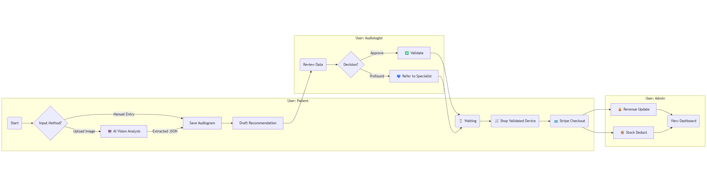

# UYARIY - Intelligent Audiology & E-Commerce Platform

**Uyariy** is a vertically integrated MVC web application designed to modernize the hearing health industry. It bridges the gap between clinical assessment and e-commerce, offering a secure platform where patients can analyze their hearing, receive medically validated recommendations, and purchase devices directly.

Built with **Ruby on Rails 8.1.1**, it leverages **Artificial Intelligence (OpenAI)** for diagnostic data extraction and **Stripe** for secure financial transactions.

---

## 🔄 The Ecosystem Flow (Connected Logic)

This diagram illustrates the lifecycle of a patient's journey and how it interacts with the clinical and business sides of the platform.



## 💻 Technology Stack

### Core Framework

* **Ruby:** 3.4.0
* **Framework:** Rails 8.1.1
* **Database:** PostgreSQL (Production & Development)
* **Frontend:** Bootstrap 5 (CDN), Turbo Drive, StimulusJS
* **Visualization:** Chart.js (Medical-grade visualization with reversed Y-Axis for audiometry)

### Integration & APIs

* **OpenAI (GPT-4o):**
    * **Computer Vision:** Analyzes uploaded audiogram charts to extract frequency/decibel data points (Red O / Blue X).
    * **Text Generation:** Auto-fills technical specifications for new products in the Admin Panel.
* **Stripe API:** Hosted Checkout sessions for secure credit card processing.
* **ActiveAdmin:** The backbone of the Staff/Clinic interface.

Key Gems

* devise: Authentication.
* cancancan: Role-Based Access Control (RBAC).
* ruby-openai: AI Client.
* stripe: Payments.
* ransack: Advanced search filters.
* kaminari: Pagination.

## 🔐 Roles & Permissions (RBAC)

The system enforces strict security boundaries. A user cannot access views outside their role.

| Role | Access Level | Responsibilities |
| :--- | :--- | :--- |
| **Patient** | **Core Access** | Can take hearing tests, view personal history, shop in the store, request appointments. **Banned** from Admin Panel. |
| **Audiologist** | **Clinical Access** | Access to `Admin/Audiograms` and `Admin/Appointments`. Can validate recommendations, adjust devices, and print clinical reports. **Restricted** from Financial Dashboard. |
| **Super Admin** | **Business Access** | Access to `Admin/Dashboard` (Revenue, Inventory, Users). Can manage products using AI Auto-Fill. **Restricted** from patient medical data creation. |

---


## 🛒 Features Breakdown

### 1. The Core (Diagnosis)
* **Inputs:** Accepts standard clinical frequencies (125Hz - 8000Hz).
* **Analysis Logic:** Calculates Pure Tone Average (PTA) and determines severity (Normal vs. Profound).
* **Logic Gate:**
    * **Normal Hearing:** Hides the store and displays a celebration message.
    * **Profound Loss:** Hides standard products and advises a Cochlear Implant specialist referral.

### 2. The Store
* Smart Filtering: Patients only see products powerful enough for their specific max decibel loss.
* Prevention: Logic prevents purchasing the same device twice ("Owned" state).
* Catalog: A public-facing store for browsing before login.

### 3. The Clinic (Admin Panel)
* **Validation Workflow:** Audiologists see "Pending" system matches. They can accept them, adjust the device model, or write clinical notes.
* **AI Auto-Fill:** Admins adding new products can click "✨ Auto-Fill" to have GPT-4o populate technical specs and battery info automatically.

## ⚙️ Local Setup & Installation

If you wish to replicate this project locally:

**1. Clone the repository**
```bash
git clone https://github.com/YOUR_USER/uyariy.git
```
**2. Install Dependencies**
```bash
bundle install
```
**3. Database Setup**
```bash
bin/rails db:create
bin/rails db:migrate
# Note: Seeds create the Super Admin only. Products must be added via Admin Panel.
bin/rails db:seed
```
**4. Set Environment Credentials** This project requires API Keys. Use the Rails credentials vault:
```bash
EDITOR="nano" bin/rails credentials:edit
```
#### Add your keys structure inside the editor:
```yaml
openai:
  access_token: sk-YOUR-OPENAI-KEY
stripe:
  publishable_key: pk_test_YOUR_STRIPE_PK
  secret_key: sk_test_YOUR_STRIPE_SK
```
**5. Run the Server**
```bash
bin/rails server
```
#### Visit http://localhost:3000.